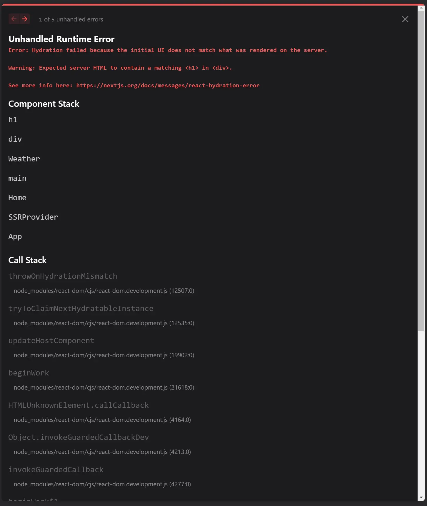

# Next-SSR Issue

[https://github.com/ReactLibraries/next-ssr](https://github.com/ReactLibraries/next-ssr)

Hydrationが失敗する問題についての再現リポジトリです。

## 最初だけ実行

```bash
docker-compose run --rm app npm i
```

## サーバー起動

```bash
docker-compose up
```

## ブラウザで確認

以下にSSRとしてアクセスすると、Hydration failedというエラーが出ます。

http://localhost:3000

```
Unhandled Runtime Error
Error: Hydration failed because the initial UI does not match what was rendered on the server.

Warning: Expected server HTML to contain a matching <h1> in <div>.

See more info here: https://nextjs.org/docs/messages/react-hydration-error
```

